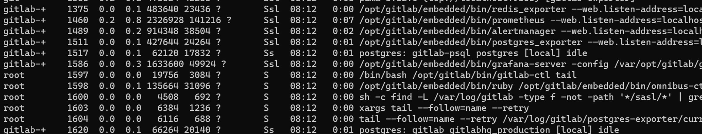

## Name

> Using gitlab official docker to debug rails backend

## Environment

1. `ps aux` 查看 gitlab 各种进程

   

2. gitlab docker 的安装路径：`/opt/gitlab`

3. 启动脚本：`/opt/gitlab/bin`

4. gitlab rails 目录：`/opt/gitlab/embedded/service/gitlab-rails`

5. gitlab rails 启动命令：`/opt/gitlab/bin/gitlab-rails`
   `exec /opt/gitlab/embedded/bin/chpst -e /opt/gitlab/etc/gitlab-rails/env ${privilege_drop} -U ${gitlab_user}:${gitlab_group} /opt/gitlab/embedded/bin/bundle exec rails "$@"`

6. Docker gitlab 查看服务: `gitlab-ctl status`

## Steps

1. 停止 `unicorn` 服务，该服务负责运行 rails，后续我们手动启动：

   ```
   gitlab-ctl stop unicorn
   ```

2. 端口占用：3000 被 grafana 占用，后续 rails 将启动在 3000 端口，需要将 grafana 停止：

   ```
   gitlab-ctl stop grafana
   ```

3. 手动启动 rails

   ```
   cd /opt/gitlab/bin && ./gitlab-rails server
   ```
